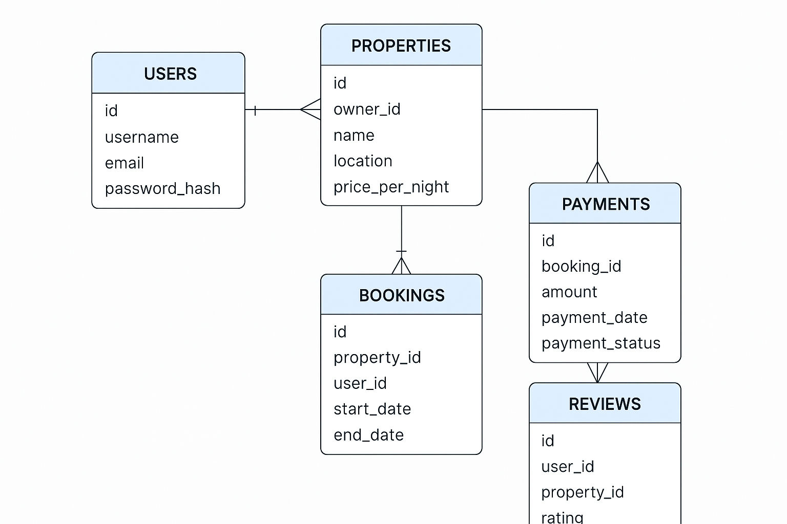

## 🏠 Overview of the RNB project

-- This project is designed to provide a scalable foundation for managing user interactions, property listings, bookings, and payment systems. It enables customers to easily discover and book their preferred hostels based on availability, location, and property type. Whether users are looking to rent or purchase, the platform ensures a smooth experience by offering relevant options tailored to their preferences.

## Project Goals of the RNB 

-- User Management: Implement a secure system for user registration, authentication, and profile management.
-- Property Management: Develop features for property listing creation, updates, and retrieval.
-- Booking System: Create a booking mechanism for users to reserve properties and manage booking details.
-- Payment Processing: Integrate a payment system to handle transactions and record payment details.
-- Review System: Allow users to leave reviews and ratings for properties.
-- Data Optimization: Ensure efficient data retrieval and storage through database optimizations.

## Team Roles

This roles is base on the project overview

🔧 1. Backend Developer
Description: Focuses on the server-side logic and database interactions.
Responsibilities:

Build and maintain APIs for listings, bookings, and users.

Handle user authentication and session management.

Integrate payment systems.

Ensure scalability and performance of the backend.

🎨 2. Frontend Developer
Description: Creates the visual interface and ensures seamless user interaction.
Responsibilities:

Build pages for property listings, bookings, profiles, etc.

Connect frontend to backend APIs.

Ensure responsive and mobile-friendly design.

Handle user input validation and error handling.

🛢️ 3. Database Engineer / Data Architect
Description: Designs and manages the structure and integrity of the database.
Responsibilities:

Create and optimize database schema (e.g., Users, Listings, Bookings).

Design relationships and constraints.

Maintain data security and backups.

Optimize queries for performance.

🧪 4. QA Engineer / Tester
Description: Ensures the platform functions as expected and remains bug-free.
Responsibilities:

Write and run test cases for different components.

Perform unit, integration, and end-to-end testing.

Identify and report bugs.

Automate testing processes using tools like Postman, Selenium, or PyTest.

🔒 5. Security Engineer (DevSecOps)
Description: Focuses on protecting the application and user data from vulnerabilities.
Responsibilities:

Implement secure login and data encryption.

Prevent common attacks (XSS, CSRF, SQL injection).

Conduct security audits and reviews.

Ensure compliance with data protection standards.

🧱 6. DevOps Engineer
Description: Manages infrastructure, deployment, and continuous integration pipelines.
Responsibilities:

Set up CI/CD pipelines (e.g., GitHub Actions).

Containerize the app using Docker.

Deploy the application to cloud platforms (e.g., AWS, Heroku).

Monitor application uptime and performance.

🎯 7. Project Manager / Scrum Master
Description: Oversees the planning, progress, and coordination of the team.
Responsibilities:

Organize sprints and stand-up meetings.

Assign tasks and track progress.

Ensure deadlines are met and blockers are addressed.

Facilitate communication between technical and non-technical members.

🧑‍💼 8. Product Owner / UI/UX Designer
Description: Bridges the gap between the users and the technical team.
Responsibilities:

Define features and user requirements.

Design user flows, wireframes, and mockups.

Conduct usability testing and gather feedback.

Ensure the product aligns with user needs and business goals.

## Technology Stack

🐍 Django
Purpose:
Django serves as the core backend framework, powering the main application logic.

Handles routing, authentication, and user management.

Manages the interaction between the API and the database.

Provides built-in admin and ORM features for faster development.

🔌 Django REST Framework (DRF)
Purpose:
Used to build RESTful APIs that enable frontend clients (like React or mobile apps) to interact with backend data.

Handles serialization of data (e.g., converting model instances into JSON).

Provides authentication, permissions, and throttling for API access.

Simplifies CRUD operations for models like User, Listing, and Booking.

🛢️ PostgreSQL
Purpose:
Acts as the primary database for storing structured data such as:

User accounts and profiles

Listings, bookings, payments, reviews

Relationships between different entities (e.g., a user can have many bookings)

🧠 GraphQL
Purpose:
Optional or complementary to REST, GraphQL provides a flexible query language to fetch exactly the data the client needs.

Reduces over-fetching/under-fetching compared to REST.

Useful for dynamic frontends that need tailored data structures.

Can live alongside REST endpoints in the same Django project.

🕒 Celery
Purpose:
Used to run background tasks asynchronously, improving performance and user experience.
Examples:

Sending booking confirmation emails

Processing payments or invoices

Scheduling reminders or notifications

⚡ Redis
Purpose:
Acts as a message broker for Celery, and is also used for:

Caching frequently used data (like listings)

Session management and storing user sessions

Reducing load on the database

📦 Docker
Purpose:
Provides containerization, allowing the project to run in isolated, reproducible environments.

Ensures the same configuration works on all developer machines and servers

Simplifies deployment by packaging the app, database, and services together

Makes testing, scaling, and continuous deployment easier

🔁 CI/CD Pipelines
Purpose:
Used to automatically test, build, and deploy code changes, improving code quality and development speed.

Run tests on every push (e.g., unit tests, lint checks)

Deploy updates to staging or production environments automatically

Can be set up using GitHub Actions, GitLab CI, Jenkins, etc.

## Database Design 

🔑 Entities, Fields & Relationships
🧑‍💼 1. Users
Description: Represents users of the platform (guests or hosts).
Key Fields:

id (Primary Key)

username

email

password_hash

date_joined

Relationships:

A user can own multiple properties.

A user can make multiple bookings.

A user can leave multiple reviews.

🏠 2. Properties
Description: Represents host-listed accommodations.
Key Fields:

id (Primary Key)

owner_id (Foreign Key → Users)

name

location

price_per_night

Relationships:

A property belongs to one user (host).

A property can have many bookings.

A property can receive many reviews.

📅 3. Bookings
Description: Represents reservations made by users for properties.
Key Fields:

id (Primary Key)

property_id (Foreign Key → Properties)

user_id (Foreign Key → Users)

start_date

end_date

Relationships:

A booking belongs to one user (guest).

A booking belongs to one property.

A booking has one payment.

💳 4. Payments
Description: Represents payment transactions for bookings.
Key Fields:

id (Primary Key)

booking_id (Foreign Key → Bookings)

amount

payment_date

payment_status

Relationships:

A payment belongs to one booking.

⭐ 5. Reviews
Description: Represents user reviews for properties after a stay.
Key Fields:

id (Primary Key)

user_id (Foreign Key → Users)

property_id (Foreign Key → Properties)

rating (e.g., 1–5 stars)

comment

Relationships:

A review belongs to one user.

A review belongs to one property.

## 🛠️  Feature Breakdown
 
1.API Documentation
OpenAPI Standard: The backend APIs are documented using the OpenAPI standard to ensure clarity and ease of integration.
Django REST Framework: Provides a comprehensive RESTful API for handling CRUD operations on user and property data.
GraphQL: Offers a flexible and efficient query mechanism for interacting with the backend.

2.User Authentication
Endpoints: /users/, /users/{user_id}/
Features: Register new users, authenticate, and manage user profiles.

3.Property Management
Endpoints: /properties/, /properties/{property_id}/
Features: Create, update, retrieve, and delete property listings.

4.Booking System
Endpoints: /bookings/, /bookings/{booking_id}/
Features: Make, update, and manage bookings, including check-in and check-out details.

5.Payment Processing
Endpoints: /payments/
Features: Handle payment transactions related to bookings.

6.Review System
Endpoints: /reviews/, /reviews/{review_id}/
Features: Post and manage reviews for properties.

7.Database Optimizations
Indexing: Implement indexes for fast retrieval of frequently accessed data.
Caching: Use caching strategies to reduce database load and improve performance.

## 🔐 API Security

1.Authentication
What It Is:
Verifies a user's identity before granting access.

How to Implement:

Use secure login with hashed passwords (e.g., Django's PBKDF2).

Use JWT (JSON Web Tokens) or session-based authentication.

Enable multi-factor authentication (MFA) (optional but recommended).

Why It's Crucial:

Prevents unauthorized access to user accounts.

Protects sensitive information like bookings and payment history.

2.Authorization
What It Is:
Ensures users can only access resources they’re allowed to.

How to Implement:

Role-based access control (RBAC): guests vs. hosts vs. admin.

Use Django permissions or custom decorators for API access.

Why It's Crucial:

Prevents users from modifying others' listings, bookings, or payments.

Enforces data ownership and privacy.

3.Rate Limiting
What It Is:
Limits the number of requests a client can make in a given time.

How to Implement:

Use Django REST Framework throttling or tools like django-ratelimit.

Apply stricter limits on authentication and payment endpoints.

Why It's Crucial:

Protects against brute-force attacks and abuse of APIs.

Preserves server performance.

4.Input Validation & Sanitization
What It Is:
Ensures all user input is clean, expected, and safe.

How to Implement:

Validate all form fields, query params, and API inputs.

Use serializers in DRF for clean data.

Escape output in frontend templates to prevent XSS.

Why It's Crucial:

Prevents attacks like SQL injection, XSS, and command injection.

5.SRF Protection
What It Is:
Prevents malicious sites from making requests on behalf of a logged-in user.

How to Implement:

Use Django's built-in CSRF middleware.

Apply CSRF tokens in forms and AJAX requests.

Why It's Crucial:

Protects authenticated users from unintentional harmful actions.

6.Secure Payments
What It Is:
Protects financial transactions and data.

How to Implement:

Use a trusted third-party payment provider (e.g., Stripe, PayPal).

Ensure HTTPS for all payment interactions.

Do not store card data — delegate to the payment provider.

Why It's Crucial:

Protects against fraud and legal liability.

Builds trust with users who enter sensitive payment data.

7.HTTPS and SSL
What It Is:
Encrypts communication between the client and server.

How to Implement:

Use HTTPS via SSL certificates (e.g., Let's Encrypt).

Redirect all HTTP traffic to HTTPS.

Why It's Crucial:

Prevents eavesdropping and man-in-the-middle attacks.

8.Logging & Monitoring
What It Is:
Tracks system activity and detects anomalies.

How to Implement:

Log failed login attempts, suspicious activity, and payment errors.

Use monitoring tools (e.g., Sentry, LogRocket) for alerts.

Why It's Crucial:

Helps detect and respond to breaches quickly.

Aids in debugging and forensic analysis.

9.Data Encryption
What It Is:
Protects sensitive data at rest and in transit.

How to Implement:

Use database encryption for fields like personal details.

Store hashed passwords, never plain text.

Encrypt data before storing in Redis or logs if sensitive.

## CI/CD Pipeline

⚙️ What Are CI/CD Pipelines?
CI/CD stands for Continuous Integration and Continuous Deployment/Delivery.
It’s a set of automated processes that help developers:

CI (Continuous Integration): Automatically test and validate code when it's pushed to the repository.

CD (Continuous Deployment/Delivery): Automatically deploy code changes to staging or production environments after passing tests.

🚀 Why CI/CD Is Important for the RNB Project
🔁 Faster Development Cycles

Automatically run tests and deploy features without manual steps.

✅ Code Quality & Reliability

Every code push triggers automated checks to catch bugs early.

🔄 Consistent Deployments

Ensures the application is deployed the same way every time.

🧪 Safe Collaboration

Multiple developers can contribute without breaking the app, since changes are continuously tested.

📉 Reduces Human Error

Minimizes mistakes during manual testing or deployment.

🛠️ Tools for CI/CD in the RNB Project
Tool	Purpose
GitHub Actions	Automates CI/CD workflows directly in the GitHub repo.
Docker	Ensures consistent environments across development, testing, and deployment.
Docker Compose	Runs multiple services (e.g., Django app, PostgreSQL, Redis) locally or in CI environments.
Heroku / AWS / Render	Hosts and deploys the application. Integrates with GitHub or CI tools.
PostgreSQL	Used in CI to test database-related features.
Sentry (Optional)	For monitoring errors after deployment.

🧪 Example Workflow with GitHub Actions
Developer pushes code to GitHub.

GitHub Actions:

Runs tests (pytest, flake8, etc.)

Builds Docker container

Deploys to Heroku (or another platform) if tests pass.